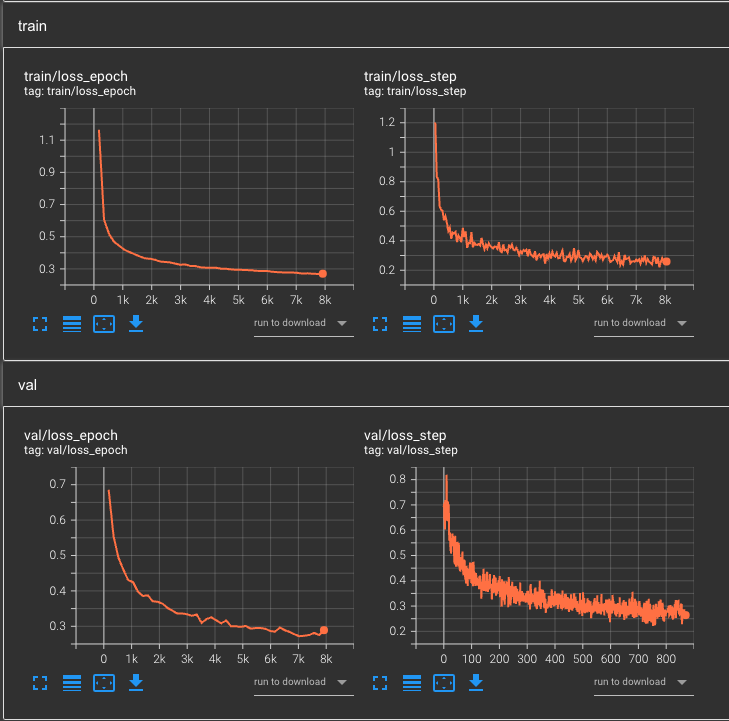

# Another boring implementation of self supervised learning for dermatology

Main source of inspiration: SimCLR

This is more or less a (almost) minimum working example for both self-supervised and supervised learning which also allows for distributed training.

## Setup
```
$ conda env create --name ssl_env python==3.8
$ conda activate ssl_env
$ python -m pip install -p requirements.txt
```

### Main blocks
- `models.py` contains 2 models
    - `class SSL_Model(pl.LightningModule)` used for self-supervised training
        - Based on [insert reference]
        - trained with `pytorch_metric_learning.losses.NTXent` loss
    - `class SL_Model(pl.LightningModule)` used for supervised training (matching encoder with `SSL_Model`)
        - Based on [insert reference]
        - trained with `torch.nn.WeightedCrossEntropy` loss
- `datasets.py` contains
    - 3 data-specific datasets
        - `class ISIC(data.Dataset)`
        - `class PadUfes20(data.Dataset)`
        - `class Fitspatrick(data.Dataset)`
    - 1 wrapper module
        - `class WrapperDataset(pl.LightningDataModule)`
- `train.py` is the main script
    - implemnts the LightningCLI logic
- `config_ssl.yaml`
    - `LightningCLI` configuration file for self-sueprvised learning
- `config_sl.yaml `
    - `LightningCLI` configuration file for sueprvised learning


## Datasets (click on the name for the download link)
| [ISIC](https://www.isic-archive.com/) | \| | [PAD UFES 20](https://data.mendeley.com/datasets/zr7vgbcyr2/1) | \| | [Fitspatrick-17k](https://github.com/mattgroh/fitzpatrick17k) |
|:-:|:-:|:-:|:-:|:-:|
| ~70k dermatological images from and 3 patient information datapoints | \| | ~2.5k clinical images and 21 patient information datapoints | \| |  ~17k clinical images and 4 patient information datapoints |

- some images in Fitspatrick-17k are incorrect (x-ray images) which have only 1 channel (BW) instead of 3 (RGB) -> after downloading the dataset, you need to manually remove those image rows from the `fitzpatrick17k.csv` file


## Running (for the self-supervised part)
### General remarks
- `trainer.logger.name` and `trainer.logger.version` are currently manually set
    - for repeated training make sure that you either let tensorboard put it in the default `lightning_logs` directory with `version_xxx` subfolders or change it manually as it will throw an `overwriting configuration file error`
- `ModelCheckpoint` callback can be modified based on the required validation metric
    - currently only `val/loss`, `val/acc`, and `val/auc` are implemented for `SL_Model` and just `val/loss` for `SSL_Model`
- currently only three ViT models are supported
    - `vit_tiny_patch16_224`, `vit_small_patch16_224`, and `vit_base_patch16_224`
    - the `model.vit_type` argument is passed without any processing to the `timm.create_model()` function, therefore you can theoretically use any model that timm supports.
        - HOWEVER: 
            - the `data.resolution` flag might need to be changed to accomodate for bigger ViTs
            - the logic of creating the classifier might need refactoring if you go over the three tested ViT models
- the current logic takes a list of augmentations from the yaml configuration file (`data.transform`)
    - feel free to add or remove augmentations depending on your task

### Hyperparameter optimization
- besides the usual ones you additionally have the `model.loss_temperature` for the NTXent loss function

### Single GPU
| YAML setup | \| |  CLI |
|:-:|:-:|:-:|
|` trainer.devices: 1 `| \| | ` python train.py fit --config config_ssl.yaml `|

### Multi GPU, 1 Node
| YAML setup | \| |  CLI | \| | with SLURM |
|:-:|:-:|:-:|:-:|:-:|
|` trainer.devices: n `| \| | ` python train.py fit --config config_ssl.yaml `| \| | `sbatch --gres=gpu:name:n --cpus-per-task=n --ntasks-per-node=n run_ssl.sh` |

## Tensorboard 
```
tensorboard --logdir logdir/ [--bind_all]
```




## Not implemented
- a test.py implementing the evaluation logic with LigtningCLI
- other lossess or optimizers
    - these can be incorporated into the yaml configuration files very easily
- other datasets: feel free to add other datasets
- code duplication optimization
- Guild.AI support
- CLI support for checkpoint loading of pretrained models (currently hard-coded)
- pretrained model zoo
- no test split of the data
- hard-coded train/val split
    - self-supervised learning: 80/20
    - supervised learning: 60/40
- ONNX export support

## References
- SimCLR
- Pytorch Lightning
- NTXent pytorch metric learning
- isic
- pad ufes
- fitspatrick

## Cite
- tba